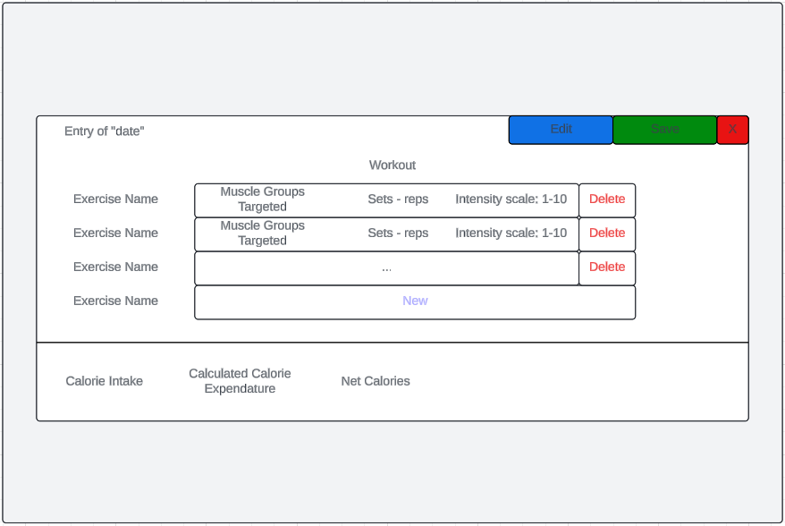
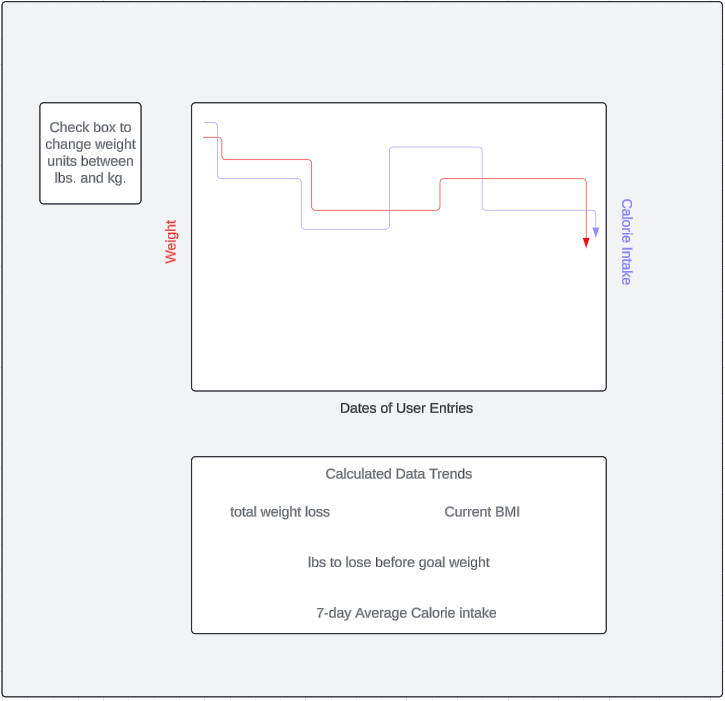

# UI Diagrams

## Calendar Page

## Calendar Entry Page

To navigate to the **Calendar Entry Page** one simply double clicks the day of the specific date entry they wish to view/edit.

On this screen users input their daily workout routine as well as calories consumed.

**Use Case**:

From this screen users can input the necessary date that is used to track progress as well as log prior workouts. Data inputted is used to calculate weight loss and body composition

## Weight Tracker Graph

On this screen users can visualize their weight as a function of time according to data from calendar entries

**Use Case**:

This page allows the user to visualize their progress based on entered data points. This allows a user to understand their progress across time.